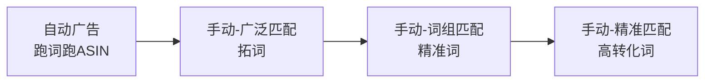

# 亚马逊跨境电商入门指南

## 一、什么是亚马逊跨境电商

**亚马逊跨境电商**是指通过亚马逊平台，将产品销售到海外市场的商业模式。中国卖家通过亚马逊全球开店（Amazon Global Selling）将商品卖给北美、欧洲、日本等全球消费者。

### 核心模式

| 模式 | 全称 | 说明 |
|------|------|------|
| **FBA** | Fulfillment by Amazon | 卖家发货到亚马逊仓库，由亚马逊负责仓储、配送、客服 |
| **FBM** | Fulfillment by Merchant | 卖家自行发货，自己处理仓储和物流 |

> 💡 新手建议从 **FBA** 入手，虽然成本较高，但流量倾斜明显，转化率更高。

---

## 二、主要站点

- **北美站**：美国、加拿大、墨西哥（流量最大，竞争最激烈）
- **欧洲站**：英国、德国、法国、意大利、西班牙（需 VAT 合规）
- **日本站**：离中国最近，物流时效快，文化差异需注意
- **澳洲站**：新兴市场，竞争相对较小
- **新兴站点**：新加坡、中东、印度等

---

## 三、开店准备清单

### 3.1 资质材料

- [ ] 公司营业执照（中国大陆、香港或美国公司）
- [ ] 法人身份证
- [ ] 双币信用卡（Visa/Mastercard）
- [ ] 收款账户（Payoneer / PingPong / WorldFirst / 连连支付）
- [ ] 品牌注册（商标，非必需但强烈建议）
- [ ] 电脑和网络（干净的 IP 环境）

### 3.2 费用预估

| 费用项 | 金额范围 |
|--------|----------|
| 月租费 | $39.99/月（专业卖家） |
| 佣金 | 销售额的 8% ~ 15%（按类目） |
| FBA仓储费 | 按体积和时间计算 |
| FBA配送费 | 按重量和尺寸计算 |
| 广告费 | 建议初期每天 $10 ~ $50 |
| 第三方工具 | $50 ~ $200/月 |

---

## 四、选品与供应链 📖 [[亚马逊选品实战方法论|选品实战]] · [[亚马逊供应链与1688采购实战|供应链采购]]

### 4.1 选品原则

1. **刚需优先**：选择需求稳定、非季节性的产品
2. **轻小为上**：降低物流成本，提高利润率
3. **差异化**：避免价格战，做有壁垒的产品
4. **利润导向**：单品净利润至少 30% 以上
5. **安全第一**：避免侵权、需要认证的敏感品类

### 4.2 选品工具

- **Jungle Scout** — 销量预估、关键词调研
- **Helium 10** — 全流程工具套件
- **Keepa** — 价格历史追踪
- **卖家精灵** — 中文卖家常用

### 4.3 红海 vs 蓝海

> 🔴 **红海品类**（慎入）：手机壳、数据线、瑜伽裤、宠物玩具  
> 🔵 **蓝海方向**（可关注）：细分场景用品、功能性家居、银发经济产品

---

## 五、Listing 优化 📖 [[亚马逊Listing优化完全指南|Listing优化完全指南]]

### 5.1 Listing 六大要素

```
标题 → 图片 → 五点描述 → A+页面 → 搜索关键词 → 价格
```

### 5.2 标题公式

```
品牌名 + 核心关键词 + 功能/属性 + 规格/数量 + 适用场景
```

**示例**：
> `ANRANKER 无线蓝牙耳机 降噪 IPX7防水 40小时续航 运动跑步适用`

### 5.3 图片规范

- 主图：纯白底，产品占 85% 以上
- 副图：场景图、功能图、尺寸图、对比图、包装图
- 建议使用 3D 渲染 + 实拍结合

### 5.4 五点描述（Bullet Points）

每一条要有 **卖点关键词 + 功能描述 + 用户利益** 的结构。

### 5.5 A+ 页面（EBC）

- 需要品牌备案
- 大幅提升转化率（数据表明可提升 5%~10%）
- 包含品牌故事、产品对比、细节展示等模块

---

## 六、PPC 广告体系 📖 [[亚马逊广告ACOS优化实战|ACOS优化]] · [[亚马逊新品广告预算分配指南|新品预算]]

### 6.1 广告类型

| 类型 | 展示位置 | 适用场景 |
|------|----------|----------|
| **SP 商品推广** | 搜索结果、商品详情页 | 基础引流，必开 |
| **SB 品牌推广** | 搜索结果顶部 | 品牌曝光，需品牌备案 |
| **SD 展示型广告** | 站内外广告位 | 再营销，防御竞品 |

### 6.2 广告打法节奏



### 6.3 竞价策略

- **固定竞价**：稳定曝光，适合新品期
- **动态竞价-仅降低**：控制ACOS，适合稳定期
- **动态竞价-提高与降低**：抢头部位置，适合冲排名

---

## 七、运营节奏

### 新品上架前——Listing 基础搭建
- [ ] 关键词调研完成
- [ ] Listing 文案准备就绪
- [ ] 图片/A+ 页面完成
- [ ] 首批库存到位

### 上架第 1-2 周——冷启动期  
- [ ] 开启自动广告，$10~$20/天
- [ ] 适当配合 Vine 计划获取评论
- [ ] 关注点击率和转化率

### 上架第 3-4 周——爬升期
- [ ] 根据广告报告优化关键词
- [ ] 开启手动广告
- [ ] 监控竞品价格和排名变化

### 第 2-3 个月——稳定期
- [ ] 精细化广告管理
- [ ] 优化供应链和物流
- [ ] 拓展变体，做产品矩阵

---

## 八、常见风险与避坑

| 风险 | 应对策略 |
|------|----------|
| **账号关联** | 一机一网一号，勿用相同资料注册多店 |
| **封号/审核** | 合规运营，不刷单、不操纵评论 |
| **侵权投诉** | 上架前做好专利排查 |
| **断货** | 安全库存天数 = 日均销量 × 补货周期 × 1.5 |
| **滞销** | 及时清仓，避免长期仓储费 |
| **VAT/税务** | 欧洲站必须合规注册 VAT |

---

## 九、常用链接与资源

- [Amazon Seller Central](https://sellercentral.amazon.com/) — 卖家后台
- [Amazon Brand Registry](https://brandservices.amazon.com/) — 品牌注册
- [Seller University](https://sellercentral.amazon.com/learn/) — 官方培训
- [Amazon Advertising](https://advertising.amazon.com/) — 广告后台

---

## 十、知识扩展阅读 ✅ 全部完成

- [[亚马逊选品实战方法论]] ✅
- [[亚马逊关键词调研方法]] ✅
- [[亚马逊广告ACOS优化实战]] ✅
- [[亚马逊新品广告预算分配指南]] ✅ NEW
- [[亚马逊FBA库存管理]] ✅
- [[亚马逊品牌注册与品牌保护]] ✅
- [[亚马逊竞品分析方法论]] ✅
- [[亚马逊站外引流全攻略]] ✅ NEW
- [[亚马逊财务管理与利润核算]] ✅ NEW
- [[亚马逊合规风控与账号安全]] ✅ NEW
- [[亚马逊Listing优化完全指南]] ✅ NEW
- [[亚马逊供应链与1688采购实战]] ✅ NEW
- [[亚马逊跨境电商期刊与学术资源]] ✅ — 学术/行业资源汇总

---

> 📌 **核心理念**：亚马逊跨境电商的本质是「产品为王 + 流量撬动 + 精细化运营」。好产品是根基，流量是放大器，运营是护城河。
