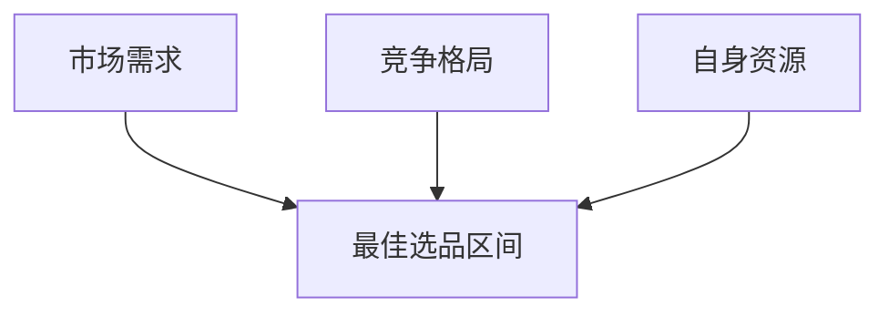

# 亚马逊选品实战方法论

> 七分靠选品，三分靠运营。选品决定了生意的上限。

---

## 一、选品的底层逻辑

### 1.1 选品的本质

选品的本质是**在市场机会和自身能力之间找到最佳交叉点**。



### 1.2 好产品的三个标准

| 标准 | 含义 | 量化指标 |
|------|------|----------|
| **卖得动** | 有真实需求 | 头部月销 > 300 单 |
| **赚得到** | 有利可图 | 毛利率 > 30% |
| **守得住** | 有差异化壁垒 | 非大路货，有改进空间 |

---

## 二、选品六大原则

### 原则一：刚需优先

选择需求稳定而非脉冲式的产品。

| ✅ 好的选择 | ❌ 差的选择 |
|-------------|-------------|
| 厨房收纳盒 | 圣诞装饰品 |
| 办公椅腰垫 | 指尖陀螺 |
| 宠物饮水机 | 网红解压玩具 |

> 刚需 = 无论有没有促销、无论什么季节，消费者都需要

### 原则二：轻小为上

| 产品尺寸 | 物流成本 | 推荐度 |
|----------|----------|--------|
| 小件标准件（< 1磅） | $3 ~ $5 | ⭐⭐⭐⭐⭐ |
| 大件标准件（1~20磅） | $5 ~ $10 | ⭐⭐⭐⭐ |
| 超大件（> 20磅） | $10+ | ⭐⭐ |

> 💡 首选**抛货系数 < 139** 的产品（体积重 ≤ 实重）

### 原则三：价格适中

```
最佳价格区间：$15 ~ $50
```

- **<$15**：利润太薄，广告成本占比高，容易亏损
- **$15~$50**：有利润空间，消费者决策门槛低，冲动购买多
- **$50~$100**：需要更强的品牌信任，转化周期长
- **>$100**：退货风险高，售后成本大

### 原则四：避开巨头

如果以下品牌占据了 Top 10，请再三考虑：

- Anker、Ailun、Apple 配件类
- 亚马逊自营（Amazon Basics 等）
- 品牌集中度高（CR5 > 80%）的类目

> 🔍 查看方法：用 Helium 10 或 Jungle Scout 看 Top 10 卖家的品牌分布

### 原则五：有改进空间

不要在红海里做「一模一样」的产品。找到可改进的维度：

| 改进维度 | 示例 |
|----------|------|
| **功能** | 普通插座 → 带 USB-C 快充的插座 |
| **材质** | 塑料花盆 → 水泥/陶瓷花盆 |
| **设计** | 纯色瑜伽垫 → 防滑纹理+对齐线瑜伽垫 |
| **组合** | 单独卖 → 套装（含配件） |
| **包装** | 白盒 → 礼品级包装 |
| **场景** | 通用 → 专门为 RV/露营/宿舍设计 |

### 原则六：合规安全

三不碰：
- ❌ **侵权不碰**：外观专利、商标、版权
- ❌ **认证门槛过高不碰**：FDA（食品接触）、FCC（无线）、CPC（儿童）
- ❌ **危险品不碰**：锂电池、液体、粉末（物流复杂）

---

## 三、选品的市场分析框架

### 3.1 市场容量判断

用一个公式快速判断：

```
市场机会 = 搜索量 × 平均售价 × (1 - 头部集中度)
```

**实操步骤**：

1. 用 **Helium 10 → Cerebro** 反查竞品 ASIN，收集关键词
2. 用 **Magnet** 查看核心关键词月搜索量
3. 搜索量 × 均价 × 预估转化率(10%) ≈ 市场容量

### 3.2 竞争格局分析

| 指标 | 蓝海 | 中性 | 红海 |
|------|------|------|------|
| 搜索量 | 5K~20K | 20K~100K | >100K |
| 评论数 (Top 10 平均) | < 300 | 300~1000 | > 1000 |
| 评分 | < 4.0 (有改进空间) | 4.0~4.3 | > 4.4 |
| 价格分布 | 集中在某区间 | 离散分布 | 两极分化 |
| 新品占比 (Top 50) | > 20% | 10%~20% | < 10% |

### 3.3 利润测算模型

```
单品利润 = 售价 - 佣金(15%) - FBA费 - 产品成本 - 头程运费 - 广告费 - 退货损耗(3%)
```

**示例计算（$29.99 产品）**：

| 项目 | 金额 | 占比 |
|------|------|------|
| 售价 | $29.99 | 100% |
| 亚马逊佣金 | -$4.50 | 15% |
| FBA配送费 | -$4.20 | 14% |
| 产品成本 | -$5.00 | 17% |
| 头程运费 | -$1.80 | 6% |
| 广告费 | -$4.50 | 15% |
| 退货损耗 | -$0.90 | 3% |
| **净利润** | **$9.09** | **30%** |

> 📊 净利润率 > 25% = 可行；> 35% = 优秀

---

## 四、选品数据工具的对比用法

### 4.1 工具矩阵

| 环节 | Jungle Scout | Helium 10 | Keepa | 卖家精灵 |
|------|:---:|:---:|:---:|:---:|
| 关键词调研 | ⭐⭐⭐ | ⭐⭐⭐⭐⭐ | — | ⭐⭐⭐⭐ |
| 销量预估 | ⭐⭐⭐⭐⭐ | ⭐⭐⭐⭐ | ⭐⭐ | ⭐⭐⭐⭐ |
| 价格历史 | — | — | ⭐⭐⭐⭐⭐ | ⭐⭐⭐ |
| 竞品追踪 | ⭐⭐⭐ | ⭐⭐⭐⭐ | ⭐⭐⭐⭐ | ⭐⭐⭐⭐ |
| 选品推荐 | ⭐⭐⭐⭐⭐ | ⭐⭐⭐ | — | ⭐⭐⭐ |

> 🛠 **推荐组合**：Jungle Scout（选品）+ Helium 10（关键词）+ Keepa（历史数据）

### 4.2 Helium 10 黑钻选品法

Helium 10 的 **Black Box** 是选品利器，推荐筛选条件：

```
月销售额：> $10,000
评论数：< 200
评分：< 4.2
价格：$15 ~ $60
重量：< 3 lbs
```

这些条件锁定的就是「卖得好但竞争壁垒还不高」的机会区间。

---

## 五、选品数据验证清单

在决定做一款产品之前，用以下清单逐项验证：

### 需求量验证
- [ ] 核心关键词月搜索量 > 5,000
- [ ] 核心关键词有 3~5 个相关长尾词
- [ ] 头部 Listing 月销量 > 300

### 竞争度验证
- [ ] Top 10 平均评论数 < 500
- [ ] 存在评分 < 4.0 的竞品（有改进空间）
- [ ] 无亚马逊自营参与
- [ ] 头部品牌 CR5 < 60%
- [ ] 最近 3 个月有新品进入 Top 50

### 利润验证
- [ ] 测算净利润率 > 25%
- [ ] 售价低于竞品均价时仍有利润
- [ ] 广告费占比 < 20% 即可盈利

### 可行性验证
- [ ] 1688 有 3 家以上供应商
- [ ] 产品无专利/外观设计风险
- [ ] 无特殊认证要求
- [ ] FBA 配送费在可接受范围
- [ ] 产品非季节性、非时效性

---

## 六、常见选品陷阱

| 陷阱 | 为什么危险 | 如何避开 |
|------|-----------|----------|
| **只看销量不看利润** | 卖得多不一定赚钱 | 每个产品先做利润测算表 |
| **追爆款** | 等你上架，风口已过 | 找上升趋势而非顶点 |
| **忽略季节性** | 旺季一过，库存成死货 | Keepa 看全年销量曲线 |
| **低估广告成本** | 平均 CPC $1.5+ 远超预期 | 预算 = 目标订单 × CPC ÷ 转化率 |
| **过度差异化** | 增加成本，用户不一定买单 | 差异化的前提是不增加 20%+ 成本 |
| **品类太大** | "Home & Kitchen"太大，找不到切入点 | 聚焦到 4-5 级子类目 |

---

## 七、一个完整的选品流程示例

假设你想进入「办公用品」大类：

```
步骤1：大类浏览
  Office Products → Office Furniture & Lighting → Desk Accessories

步骤2：数据筛选（Black Box）
  → 月销 > $10K，评论 < 300，价格 $15~$40

步骤3：发现候选
  → 「显示器增高架」：月搜索量 18K，Top10 平均评论 280

步骤4：差评分析
  → 竞品差评集中在"不稳、晃动、承重不够"
  → ✅ 这就是改进方向：加粗桌腿、加防滑垫、提升承重到 50lbs

步骤5：利润测算
  → 售价 $32.99，成本 $7，净利润约 $9 → 利润率 27% ✅

步骤6：供应商洽谈
  → 1688 找 3 家，要样品，确认改进方案的可行性

步骤7：最终决策
  → 数据过关 + 有明确改进空间 + 利润达标 = 开干 🚀
```

---

## 八、选品阶段 Checklist

### 初步筛选（淘汰 80%）

- [ ] 符合「六大原则」中的至少 4 条
- [ ] 有明确的差评改进方向
- [ ] 非侵权产品（USPTO 已查）
- [ ] 非大品牌垄断类目

### 深度验证（淘汰 15%）

- [ ] 利润测算表完成，数据漂亮
- [ ] 供应商至少有 3 个选择
- [ ] 样品到手，质量过关
- [ ] Keepa 价格历史无异常波动

### 最终确认（留下 5%）

- [ ] 差异化方案可落地
- [ ] 首批试单 200~500 件可承受亏损
- [ ] 关键词策略已准备好
- [ ] 备选方案（Plan B）已想好

---

## 九、推荐学习资源

- **书籍**：《亚马逊选品上岸攻略》
- **播客**：《跨境知道》《大数跨境》
- **YouTube**：Helium 10 官方频道、Jungle Scout 官方频道
- **社群**：知无不言跨境电商社区

---

> 🎯 **核心法则**：选品不是选一个完美的产品，而是选一个「你能做出差异化、有利润空间、市场在增长」的产品。完成 > 完美，先跑通一个闭环再放大。

---

关联笔记：
- [[亚马逊跨境电商入门指南]] — 回到总纲
- [[亚马逊竞品分析方法论]] — 深入竞品分析
- [[亚马逊关键词调研方法]] — 关键词选品法
